# 12-MySQL

# Node.js & MySQL

## Overview
- This CLI App takes in orders from customers and depletes stock from the store's inventory similar to an Amazon-like storefront using MySQL.
- The app tracks product sales across the store's departments and provides a summary of the highest-grossing departments in the store.

## Instructions
1. Created a MySQL Database called bamazon
2. Created two tables inside of the database called products and departments
  - The products table holds each of the following columns:
    * item_id (unique id for each product)
    * product_name (Name of product)
    * department_name
    * price (cost of customer)
    * stock_quantity (how much of the product is available in stores)
  - The departments table holds each of the following columns:
    * department_id
    * department_name
    * over_head_costs
    * product_sales
4. The database holds 17 different products from 4 different departments (i.e. Office Supplies, Clothing, Grocery, Home & Garden)
5. Created 3 node applications called:
  - bamazonCustomer.js (Running this application will first display all of the items available for sale. Includes the ids, names, and prices of products for sale)
  - bamazonManager.js (Running this application will list a set of menu options from View Products for Sale, View Low Inventory, Add to Inventory, Add New Product)
  - bamazonSupervisor.js (Running this application will list a set of menu options that include View Product Sales by Department and Create New Department)

## Installations
- database sql
- node.js
- npm packages
- mysql
- inquirer

## Screenshots Of Application

### Create Database
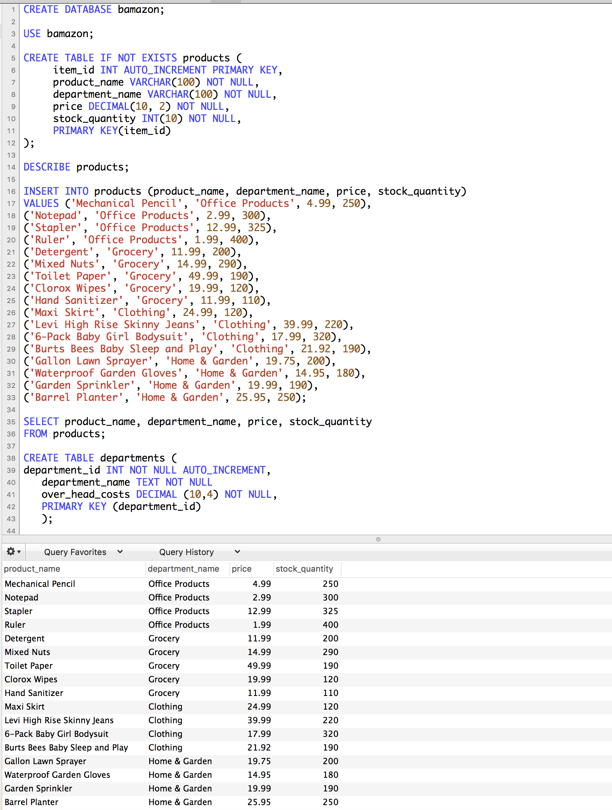

### bamazonCustomer.js
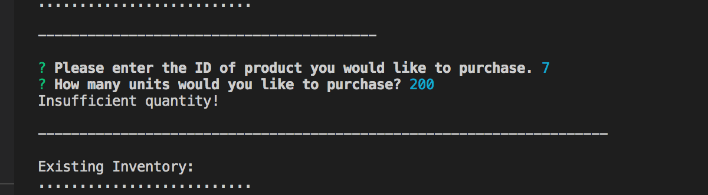
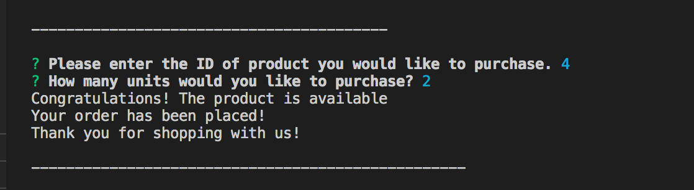

### bamazonManager.js
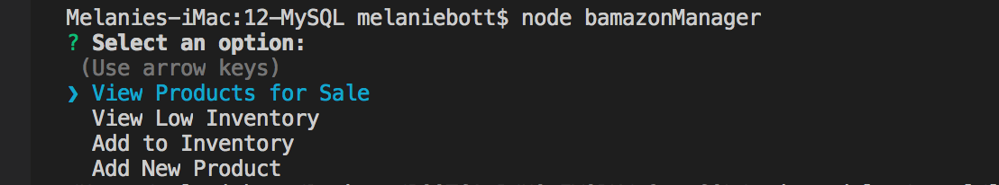
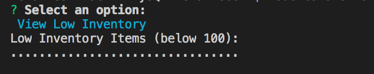

### bamazonSupervisor.js
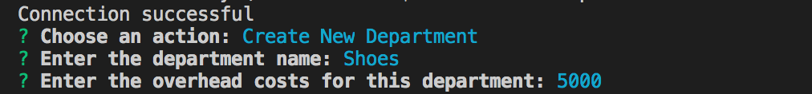
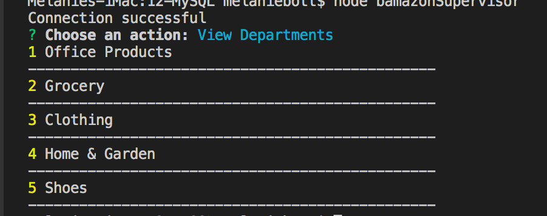

### SQL
#### Products Table
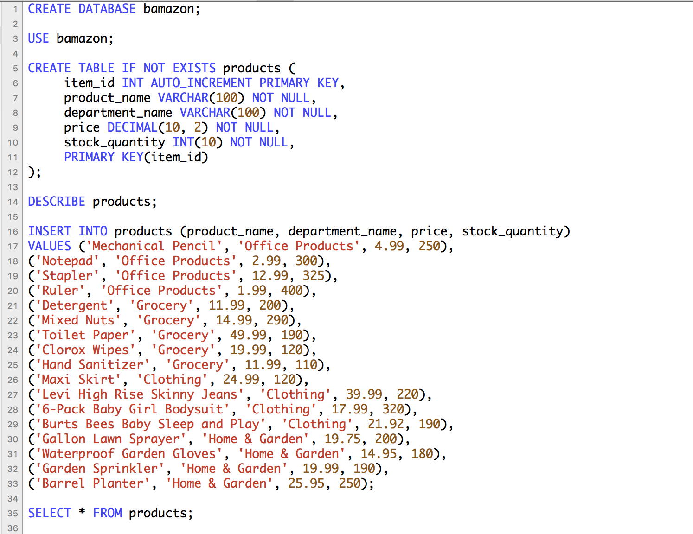
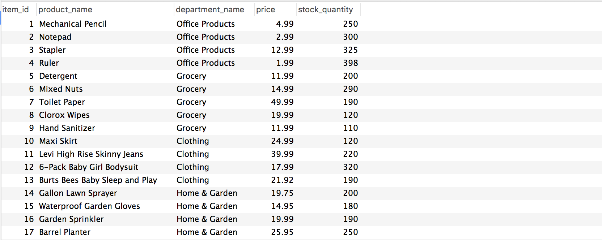

#### Departments Table
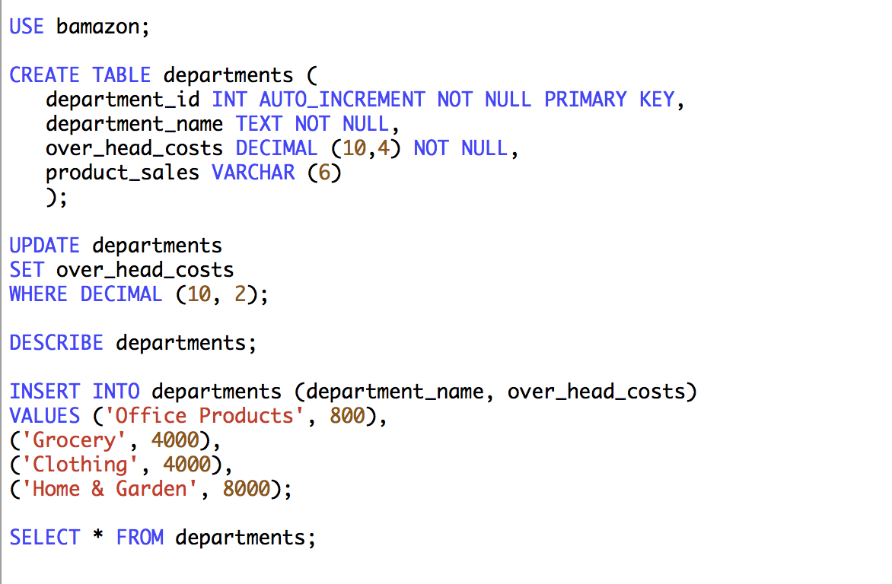
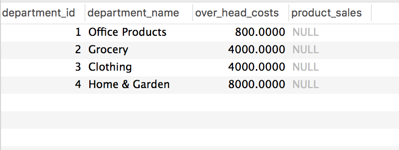
